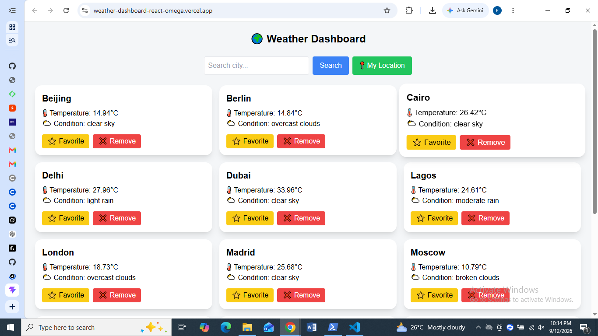
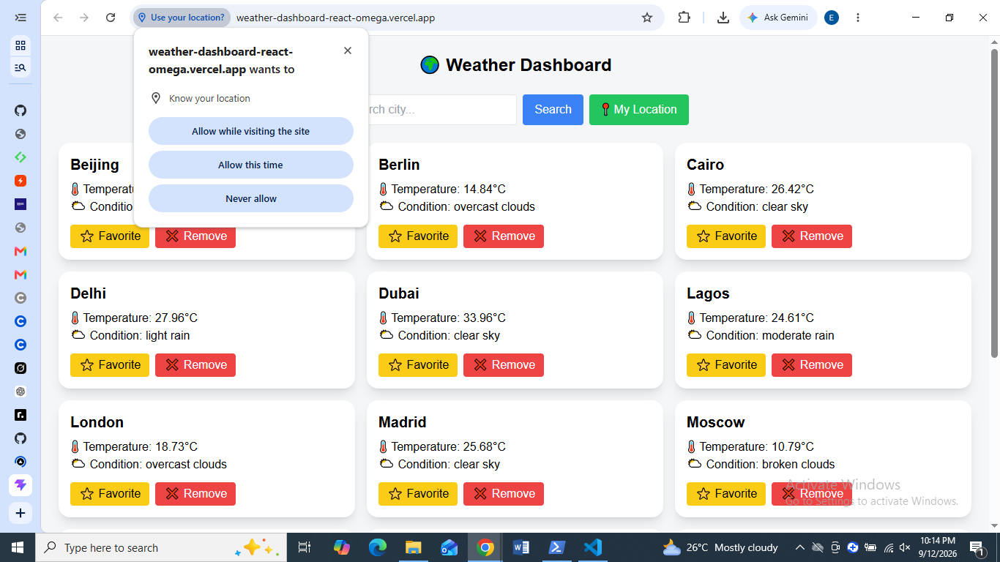
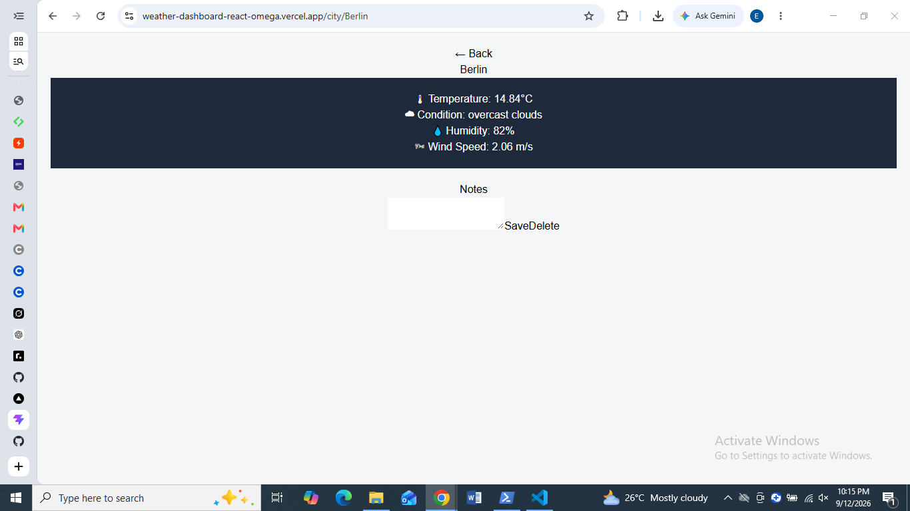

# 🌤️ Weather Dashboard

A responsive React weather application built to explore API integration, component-based UI development, client-side application structure, responsive design, and practical frontend engineering.

---

## 🌐 Live Application

[View Live Application](https://weather-dashboard-kappa-sable.vercel.app/)

---

## 📸 Screenshots

### Home



### City Details



### Responsive Layout



---

## 📖 Project Overview

The Weather Dashboard is a React-based web application that allows users to retrieve and explore weather information through an external weather API.

The project was developed as part of my software engineering learning journey, with a focus on understanding how a modern frontend application communicates with external services and transforms API data into a usable interface.

Rather than treating the project as only a visual frontend exercise, the application provided practical experience with:

- React application architecture
- API integration
- asynchronous data retrieval
- component-based development
- client-side navigation
- responsive UI development
- application state
- online/offline detection
- project organization
- Git and GitHub workflows

---

## 🎯 Project Goals

The main goals of the project were to:

1. Build a functional React application.
2. Integrate an external weather API.
3. Separate API logic from presentation logic.
4. Create reusable application components.
5. Build responsive interfaces.
6. Handle different application states.
7. Practice organizing a real frontend project.
8. Manage the project using Git and GitHub.

---

## ✨ Features

### Weather Search

Users can search for weather information and retrieve results from the application's weather service.

### City Details

The application provides a dedicated city details experience for viewing weather information.

### API Integration

Weather information is retrieved through a dedicated weather service rather than placing API logic directly inside UI components.

### Responsive Interface

The application is designed to adapt to different screen sizes.

### Online / Offline Detection

The application includes an online-status hook that allows the application to detect connectivity changes.

### Component-Based Architecture

The interface is divided into React components and pages rather than being implemented as one large component.

---

## 🏗️ Application Architecture

The application follows a simple frontend architecture:

```text
User
  │
  ▼
React Interface
  │
  ├── Home
  │
  └── City Details
          │
          ▼
    Weather Service
          │
          ▼
     Weather API
          │
          ▼
     Weather Data
          │
          ▼
    React Interface
```

The application separates the user interface from the logic responsible for communicating with the weather service.

---

## 🛠️ Technology Stack

| Technology | Purpose |
|---|---|
| React | User interface |
| JavaScript | Application logic |
| Vite | Development and build tooling |
| Tailwind CSS | Styling and responsive design |
| Weather API | External weather data |
| ESLint | Code quality |
| Git | Version control |
| GitHub | Repository hosting |

---

## 📁 Project Structure

```text
Weather-Dashboard/
├── public/
│
├── src/
│   ├── assets/
│   ├── hooks/
│   │   └── useOnlineStatus.js
│   │
│   ├── pages/
│   │   ├── Home.jsx
│   │   └── CityDetails.jsx
│   │
│   ├── services/
│   │   └── weatherService.js
│   │
│   ├── App.jsx
│   ├── main.jsx
│   └── style.css
│
├── .gitignore
├── eslint.config.js
├── index.html
├── package.json
├── package-lock.json
├── postcss.config.js
├── tailwind.config.js
└── vite.config.js
```

---

## 🔌 API Integration

Weather API communication is separated into:

`src/services/weatherService.js`

This separation helps keep API-related functionality independent from the presentation layer.

The general flow is:

```text
User Request
     ↓
React Component
     ↓
Weather Service
     ↓
External API
     ↓
API Response
     ↓
Application State
     ↓
UI
```

---

## 🌐 Responsive Design

The application uses Tailwind CSS to create responsive layouts.

The interface is designed to remain usable across:

- Desktop screens
- Laptop screens
- Tablet screens
- Mobile devices

---

## 🔐 Security Considerations

Although this is primarily a frontend application, security considerations are still relevant.

Important considerations include:

- API key protection
- Environment variables
- Avoiding hard-coded secrets
- Input validation
- Safe handling of external API responses
- Avoiding unnecessary exposure of sensitive configuration

Secrets should never be committed to GitHub.

---

## 🧪 Testing

Testing and validation for the application includes checking:

- Weather searches
- API responses
- City details
- Loading states
- Error states
- Responsive layouts
- Online/offline behavior
- Different screen sizes

Automated testing can be expanded as the project develops.

---

## 💻 Local Development

### Requirements

- Node.js
- npm
- Git

### Clone the Repository

```bash
git clone https://github.com/EmoleEmma/Weather-Dashboard.git
```

### Install Dependencies

```bash
cd Weather-Dashboard
npm install
```

### Environment Variables

If required by the weather service, create:

`.env`

and configure the required API credentials.

Never commit environment files containing secrets.

### Start Development Server

```bash
npm run dev
```

### Production Build

```bash
npm run build
```

### Preview Production Build

```bash
npm run preview
```

---

## 📚 What I Learned

This project helped strengthen my understanding of:

- React
- JavaScript
- API integration
- asynchronous programming
- frontend architecture
- responsive design
- component organization
- Git and GitHub
- environment configuration
- handling application states

---

## 🧩 Challenges and Solutions

### Separating API Logic

One challenge was keeping external API communication separate from the UI.

The weather service was therefore placed in:

`src/services/weatherService.js`

This makes the application's structure easier to understand and maintain.

### Handling Connectivity

The project includes an online-status hook:

`src/hooks/useOnlineStatus.js`

This allows the application to respond to connectivity changes.

---

## 🔮 Future Improvements

Potential improvements include:

- Improved error handling
- More detailed weather information
- Forecast functionality
- Geolocation-based weather
- Improved loading states
- Automated testing
- Improved accessibility
- Better API error handling
- Performance optimization
- Expanded responsive design
- Weather history and saved locations

---

## 👨‍💻 Author

**Emmanuel Emole**

Computer Science student focused on Software Engineering, Application Security, and Cloud Technologies.

[GitHub](https://github.com/EmoleEmma)
[LinkedIn](https://www.linkedin.com/in/chibuikem-emole-b115113a2)
